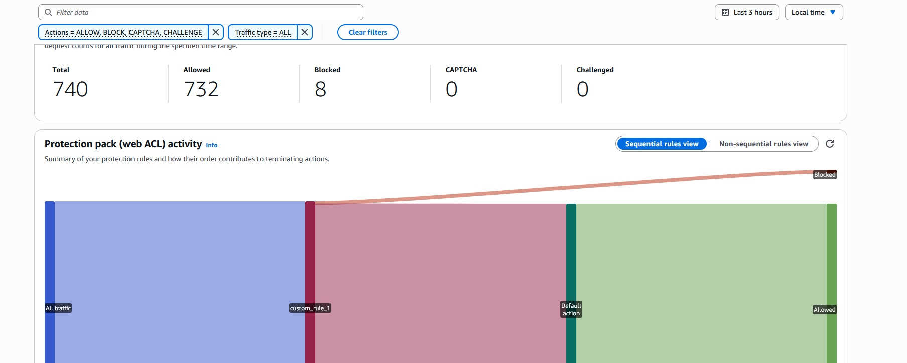

# ☁️ AWS Cloud Portfolio

**Live Demo:** [Click Me!](https://djynxtnis5be4.cloudfront.net/)
---

## 🇬🇧 English Version

### 🎯 Project Overview
This repository hosts the source code and infrastructure definitions for my personal cloud portfolio. The project demonstrates a **Serverless**, **Secure**, and **High-Performance** architecture on AWS.
Unlike basic static hosting, this project implements enterprise-grade security practices using **Terraform** for Infrastructure as Code (IaC) and **AWS WAF** for edge protection.

### 🏗️ Architecture Roadmap
The project follows a phased evolution to demonstrate increasing cloud complexity:

*   **Phase 1: Static Foundation (Completed ✅)**
    *   Responsive HTML5/CSS3/JS frontend with "Cyber-Security" theme.
    *   Local development environment setup.

*   **Phase 2: AWS Infrastructure (Completed ✅)**
    *   **IaC:** Full provisioning via Terraform.
    *   **Storage:** Private S3 Bucket with Public Access Block enabled.
    *   **CDN:** Global content delivery via CloudFront Edge Locations.
    *   **Security:** OAC (Origin Access Control) to restrict S3 access *only* to CloudFront.
    *   **Encryption:** Enforced HTTPS and TLS certificates.

*   **Phase 3: Advanced Security (PoC Completed ✅)**
    *   **WAF:** Implementation and live testing of AWS Web Application Firewall rules to mitigate DDoS vectors.

---

### 🛡️ Security Showcase: WAF In Action
To validate the security posture, I configured a custom Web ACL and performed a live simulated attack against the infrastructure.

#### 1. Configuration
I implemented a **Rate Limit Rule** to automatically block IPs exceeding 100 requests within a 5-minute window.

*Fig 1: Configuring the custom Rate-Based rule in the AWS Console.*

#### 2. The Attack (Simulation)
I generated high-frequency traffic by refreshing the page hundreds of times in a short time. The requests were intercepted immediately at the Edge.

*Fig 2: The WAF successfully blocked the traffic, returning a 403 Forbidden response.*

#### 3. Telemetry & Analysis
CloudWatch metrics confirmed the defense efficacy.

*Fig 3: Real-time telemetry showing legitimate traffic (Green) vs. blocked malicious traffic (Red).*

---

### 🛠️ Tech Stack
*   **Infrastructure:** Terraform, AWS S3, AWS CloudFront, AWS WAF.
*   **Frontend:** HTML5, CSS3, Vanilla JS.
*   **Tools:** AWS CLI, Git.

---

---

## 🇮🇹 Versione Italiana

### 🎯 Panoramica Progetto
Questo repository ospita il codice e l'infrastruttura del mio portfolio cloud. Il progetto dimostra un'architettura **Serverless**, **Sicura** e ad **Alte Prestazioni** su AWS.
A differenza di un semplice hosting statico, questo progetto implementa standard di sicurezza enterprise utilizzando **Terraform** per l'Infrastructure as Code (IaC).

### 🏗️ Roadmap Architetturale
Il progetto segue un'evoluzione a fasi per dimostrare competenze cloud crescenti:

*   **Fase 1: Fondamenta Statiche (Completata ✅)**
    *   Frontend HTML5/CSS3/JS responsivo con tema "Cyber-Security".
    *   Ambiente di sviluppo locale.

*   **Fase 2: Infrastruttura AWS (Completata ✅)**
    *   **IaC:** Provisioning completo via Terraform.
    *   **Storage:** Bucket S3 Privato (Block Public Access attivo).
    *   **CDN:** Distribuzione globale tramite CloudFront.
    *   **Sicurezza:** OAC (Origin Access Control) per limitare l'accesso S3 *solo* a CloudFront.
    *   **Crittografia:** HTTPS forzato e certificati TLS.

*   **Fase 3: Sicurezza Avanzata (PoC Completata ✅)**
    *   **WAF:** Implementazione e test pratico di AWS Web Application Firewall per mitigare attacchi DDoS.

---

### 🛡️ Security Showcase: Il WAF in Azione
Per validare la sicurezza, ho configurato una Web ACL personalizzata ed eseguito una simulazione di attacco live contro l'infrastruttura.

#### 1. Configurazione
Ho implementato una regola di **Rate Limit** per bloccare gli IP che superano le 100 richieste in 5 minuti.

*Fig 1: Configurazione della regola Rate-Based nella console AWS.*

#### 2. L'Attacco (Simulazione)
Ho generato traffico ad alta frequenza refreshando la pagina centinaia di volte in un breve tempo. Le richieste sono state intercettate immediatamente all'Edge.

*Fig 2: Il WAF ha bloccato il traffico restituendo un errore 403 Forbidden.*

#### 3. Telemetria e Analisi
Le metriche di CloudWatch confermano l'efficacia della difesa.

*Fig 3: Il grafico mostra in rosso il traffico malevolo bloccato automaticamente.*

---

### 🛠️ Stack Tecnologico
*   **Infrastruttura:** Terraform, AWS S3, AWS CloudFront, AWS WAF.
*   **Frontend:** HTML5, CSS3, Vanilla JS.
*   **Strumenti:** AWS CLI, Git.

---

### 📬 Contact / Contatti
**Giuseppe La Selva** - Cloud & Security Enthusiast
📧 [g.laselva@outlook.it](mailto:g.laselva@outlook.it)
💼 [LinkedIn Profile](https://www.linkedin.com/in/giuseppe-laselva)

